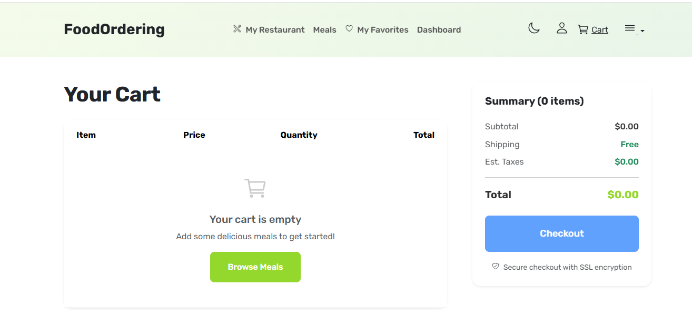
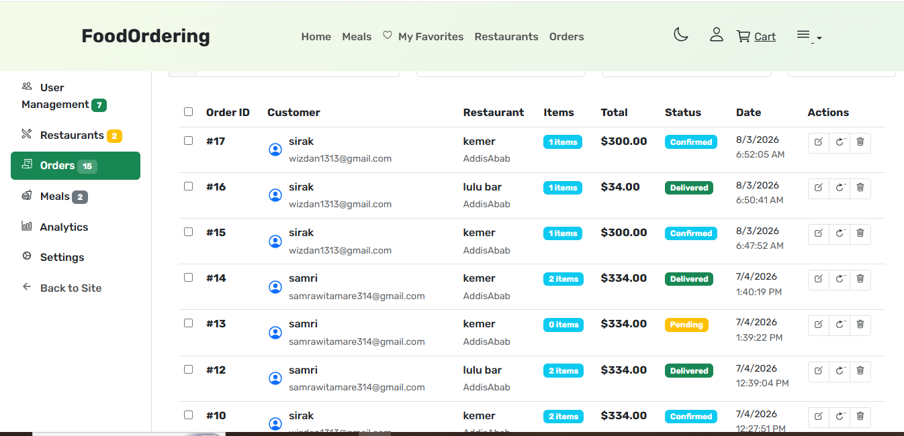

# Food Ordering Platform 🍔

**Key Features**
- Authentication and role-based access (Admin, Restaurant Owner, Delivery, Customer)  
- Order management and workflow system  
- Backend API and database integration (PostgreSQL)  
- Responsive frontend extended from static design to dynamic system  


A Django web app for ordering food online. Restaurant owners can manage their meals, customers can browse and order, delivery people can handle deliveries, and admins can manage everything.

## What We Built

## 📸 Screenshots

### 🏠 Customer Experience

#### Home & Restaurant Browsing


#### Cart & Checkout


#### Order Tracking


---

### 🏪 Restaurant Owner Dashboard


#### Restaurant Order Management


---

### 🚚 login Dashboard


---

### 📊 Admin Dashboard


---

### 📱 customer dasboard


### ✅ Complete Features
- **User System**: Sign up and log in with username or email
- **Restaurant Management**: Owners can add meals, edit restaurant info, manage orders
- **Customer Features**: Browse meals, add to cart, checkout, track orders
- **Delivery System**: Delivery people can accept orders, update status, track earnings
- **Admin Dashboard**: Full admin panel with analytics, charts, and user management
- **Order Tracking**: Real-time order status updates for all user types
- **Role-Based Access**: Different permissions for customers, owners, delivery, and admins

### 🎯 Latest Updates (v2.0)
- **Complete Delivery Workflow**: Full delivery management with proper status transitions
- **Restaurant Order Management**: Working "View Details" and status update buttons
- **Enhanced Analytics**: All charts working (Platform Growth, User Distribution, Order Status, etc.)
- **Role-Based Navigation**: Different navbar items and profile views per user role
- **Order Tracking Access Control**: Restaurant owners can view orders from their restaurant
- **Delivery Profile Enhancement**: Status update buttons instead of track buttons
- **Real-time Notifications**: Auto-refresh and sound alerts for new orders
- **Professional UI/UX**: Consistent design across all user interfaces

## User Roles & What They Can Do

### Customer
- Browse restaurants and meals
- Add items to cart and checkout
- Track order status
- View order history
- Manage favorites

### Restaurant Owner
- Add and manage restaurant details
- Create and edit meals with images and prep times
- Complete order management workflow:
  - Pending → Confirm → Confirmed
  - Confirmed → Start Preparing → Preparing
  - Preparing → Mark Ready → Ready (for delivery pickup)
- View detailed order information in modals
- Access restaurant analytics and performance metrics
- Manage orders from both dashboard and dedicated orders page

### Delivery Person
- Accept orders that are ready for pickup
- Update order status through complete workflow:
  - Ready → Accept → Picked Up
  - Picked Up → On the Way → In Transit  
  - In Transit → Delivered → Completed
- View real-time delivery stats and earnings
- Auto-refresh dashboard with sound notifications
- Manage deliveries from profile page with status buttons
- Track complete delivery history
- *Restricted from accessing meals, cart, and ordering features*

### Admin
- Manage all users and restaurants
- View platform analytics with charts
- Oversee all orders
- Access detailed statistics
- Manage platform settings

## How to Run This Thing

### 1. Get the Code
```bash
git clone [your-repo-url]
cd Food_Ordering_Platform
```

### 2. Set Up Python Environment
```bash
# Create virtual environment
python -m venv food

# Activate it (Linux/Mac)
source food/scripts/activate

```

### 3. Install Dependencies
```bash
pip install -r requirements.txt

```


### 5. Run Migrations
```bash
python manage.py makemigrations
python manage.py migrate
```

### 6. Create Admin User
```bash
python manage.py createsuperuser
```

### 7. Start the Server
```bash
python manage.py runserver
```

### 8. Open Your Browser
Go to `http://127.0.0.1:8000`

## Complete Order Workflow

### 🛒 Customer Phase
1. **Customer** places order → `pending`

### 🍳 Restaurant Phase  
2. **Restaurant** confirms order → `confirmed`
3. **Restaurant** starts preparing → `preparing`
4. **Restaurant** marks ready for pickup → `ready`

### 🚚 Delivery Phase
5. **Delivery** accepts order → `picked_up`
6. **Delivery** starts journey → `in_transit`  
7. **Delivery** completes delivery → `delivered`

**Key Features:**
- Clear role separation: Restaurant handles preparation, Delivery handles transportation
- No status conflicts: Each role controls their part of the workflow
- Real-time updates: All parties see current status immediately
- Professional UI: Context-appropriate buttons for each status transition

## File Structure
```
Food_Ordering_Platform/
├── users/              # User accounts, profiles, admin dashboard
├── restaurants/        # Restaurant management
├── meals/             # Meal listings and details  
├── orders/            # Order processing and delivery
├── admin_panel/       # Admin API endpoints and decorators
├── static/            # CSS, JS, images
└── templates/         # HTML templates
```

## Tech Stack
- **Django 5.2.6** - Web framework
- **MySQL** - Database
- **Bootstrap 5** - Frontend styling
- **Chart.js** - Analytics charts
- **JavaScript** - Dynamic interactions
- **Python 3.12** - Programming language

## Major Improvements & Bug Fixes

### 🔧 Fixed Issues
- **Django Admin Separation**: Restored default `/admin/` untouched; moved custom admin APIs to `/admin-api/` and updated namespace to `admin_api`
- **Admin URL Conflicts**: Fixed `NoReverseMatch` by updating all `admin:` links to `admin_api:` in templates and views
- **Restaurant Reverse Relations**: Replaced `restaurant.meals` with `restaurant.meal_set` where needed
- **Owner Access Lockdown**: Owners cannot access other restaurants by URL guessing (404 on mismatch)
- **Cart Script Duplication**: Prevent duplicate `CartManager` initialization and removed extra script includes
- **Cart & Checkout Images**: Show real meal images with graceful fallback icons
- **Charts**: Fixed User Distribution chart init and data loading in custom admin dashboard
- **Add Meal Flow**: Admins select restaurant or pass `/add-meal/<id>/`; owners unaffected
- **Restaurant Settings**: Dynamic per-restaurant settings `/restaurants/settings/<id>/` with selection for admins
- **Dashboard Navigation**: All sidebar/action links now context-aware (Overview, Orders, Manage Meals, Settings)
- **Dashboard Meal Actions**: Edit/Delete buttons work directly from dashboard list
- **Order Pages Consistency**: Checkout success timeline matches order tracking status logic

### 🚀 New Features
- **Multi-stage Order Status**: Complete workflow with proper role separation
- **Real-time Delivery Dashboard**: Auto-refresh with sound notifications for new orders
- **Enhanced Profile Pages**: Role-specific content and functionality
- **Professional Order Management**: Working modals, status updates, and notifications
- **Comprehensive Analytics**: Platform growth, user distribution, order status charts
- **Mobile-Friendly Interface**: Responsive design for delivery personnel on mobile

## Key Features Implemented

### Analytics Dashboard
- Platform growth charts
- User distribution by role
- Order status tracking
- Restaurant performance metrics
- Revenue analytics

### Delivery Management
- Real-time order polling
- Automatic notifications for new orders
- Multi-stage status updates
- Earnings tracking
- Delivery history

### Role-Based Security
- Custom decorators for access control
- Different navbar items per role
- Restricted views based on permissions
- Secure API endpoints

### Order Tracking
- Real-time status updates
- Restaurant owner controls
- Customer tracking interface
- Delivery status management

## Common Issues

**Database Connection Error?**
- Make sure MySQL is running
- Check database credentials in `settings.py`
- Install `mysqlclient` package

**Charts Not Showing?**
- Charts load dynamically from API endpoints
- Check browser console for JavaScript errors
- Ensure Chart.js is loading properly

**Delivery Dashboard Empty?**
- Make sure user role is set to 'delivery'
- Check that orders exist with status 'confirmed' or 'preparing'
- Verify API endpoints are working

**Can't Update Order Status?**
- Check user permissions for the specific action
- Ensure CSRF token is included in AJAX requests
- Verify order is in correct status for transition

## Development Notes

- All charts use Chart.js with dynamic data loading
- AJAX requests include CSRF protection
- Role-based decorators prevent unauthorized access
- Order status transitions follow a strict flow
- Real-time updates use polling (can be upgraded to WebSockets)

## What's New (This Sprint)
- Separated default Django admin from custom admin panel to remove conflicts
- Introduced per-restaurant routing for dashboard, orders, meals, and settings
- Added a generic restaurant selection page for admin actions
- Hardened owner authorization on all restaurant and order endpoints
- Fixed cart and checkout images to use uploaded meal images
- Unified order status UI across success and tracking pages

## Future Enhancements
- **WebSocket Integration**: Replace polling with real-time WebSocket notifications
- **Payment Gateway**: Integrate Stripe/PayPal for actual payment processing  
- **Mobile App**: Create React Native/Flutter app using Django REST API
- **GPS Tracking**: Real-time delivery tracking with maps integration
- **Advanced Analytics**: Revenue forecasting, customer behavior analysis
- **Multi-language Support**: Internationalization for different markets
- **Email Notifications**: Order confirmations and status updates via email
- **Rating System**: Customer reviews and restaurant ratings

---
*Built with Django, lots of debugging, and way too much coffee ☕*
